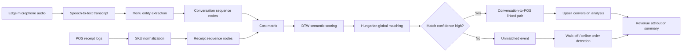

# CABS Engine

Cart-Acoustic Bipartite Synchronization Engine

## One-line summary

The CABS Engine is a confidence-based Python proof of concept that aligns edge microphone conversations to POS receipts in noisy offline retail and QSR environments without requiring perfect clock synchronization.

## Problem Statement

In high-volume restaurants and quick service retail, edge microphones capture customer-counter conversations while POS systems record final bills. The two streams are often not perfectly synchronized. Clock drift, delayed receipt creation, bundled SKUs, and noisy item ordering can make timestamp-only matching unreliable.

This PoC demonstrates a more robust alternative: treat audio events and receipts as two noisy event streams, normalize the menu entities, compare them semantically with DTW, apply a soft temporal penalty, and then solve the full assignment problem globally.

## Why Timestamp-Only Matching Fails

Simple timestamp matching assumes the edge microphone and the POS terminal agree on time. In practice, that breaks because:

* the audio device and POS terminal can drift by minutes
* receipts are often written after the conversation finishes
* bundled items may not appear in the same order
* walk-offs and online delivery orders do not have a direct counterpart in the other stream

This PoC therefore avoids claiming deterministic matching. It produces a confidence score and leaves weak links unmatched.

## How the CABS Engine Works

The CABS Engine does not require perfect hardware clock synchronization between edge microphones and POS systems. Instead, it treats the problem as a bipartite matching task between two noisy event streams. It combines semantic similarity between spoken menu entities and billed SKUs with a soft temporal penalty, then uses global optimization to find the best overall alignment.

Pipeline:

1. Generate mock acoustic and POS streams for a 15-minute store window.
2. Normalize menu entities and expand bundled SKUs into comparable item sequences.
3. Convert entities into stable integer ids.
4. Score each audio-receipt pair with DTW-based semantic distance.
5. Add a soft penalty for timestamp drift.
6. Solve the global assignment with the Hungarian algorithm.
7. Reject weak pairs using a confidence threshold.
8. Classify unmatched audio as potential walk-offs and unmatched receipts as likely online orders.

## Architecture Flow



## Example Output

The script prints:

* acoustic events
* POS receipts
* the weighted cost matrix
* matched pairs with confidence, upsell result, and revenue
* unmatched audio events
* unmatched POS receipts
* summary metrics

Example matched pair fields:

* `audio_id`
* `receipt_id`
* `confidence`
* `spoken_entities`
* `billed_skus`
* `upsell_result`
* `revenue_amount`

Sample summary excerpt:

```text
matched pairs: 8
walk-offs detected: 1
online orders detected: 1
upsells converted: 1
upsells missed: 1
realized upsell revenue estimate: 279
```

## How to Run Locally

```bash
python -m venv .venv
.venv\Scripts\activate
pip install -r requirements.txt
python main.py
```

## How to Run with Docker

```bash
docker build -t cabs-engine .
docker run --rm cabs-engine
```

## Why This Matters for Offline Retail / QSR Intelligence

This type of alignment layer can support:

* better revenue attribution
* upsell conversion analysis
* operational anomaly detection
* queue and walk-off intelligence
* offline retail analytics where hardware clocks are imperfect

It is especially useful when you want a practical confidence-based alignment approach rather than a brittle timestamp join.

## Future Improvements

* Replace mock data with real ASR transcripts and POS event feeds
* Add learned item embeddings for richer semantic similarity
* Calibrate confidence scores with labeled ground truth
* Add customer/session-level context to reduce ambiguity
* Persist matches to a database or event warehouse
* Extend the matching layer to handle many-to-many session fragments

## Positioning

This PoC demonstrates a confidence-based alignment approach, reduces reliance on simple timestamp matching, and can be extended with real ASR, POS APIs, and ground-truth validation.
